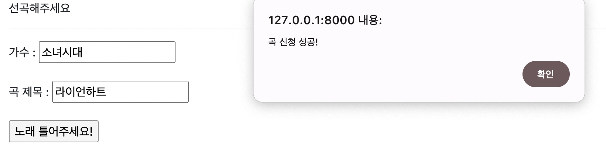
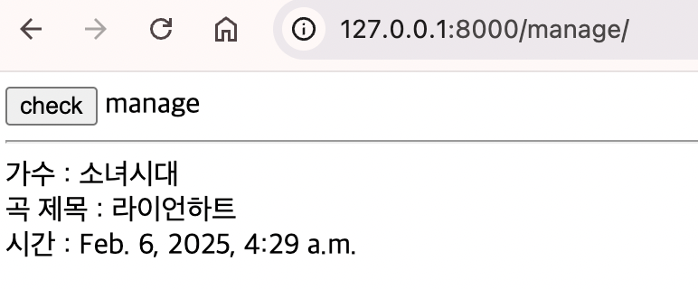

# 🎵 해커톤 뮤직 플레이어 🦁

멋쟁이사자처럼 해커톤 '여기톤(herethon)'을 위한 음악 신청 플랫폼입니다. 해커톤 참가자들이 작업하면서 듣고 싶은 음악을 신청하고, 운영진이 관리할 수 있습니다.

## 🚀 주요 기능

### 1. 음악 신청 페이지 (/)

- 가수와 곡 제목을 입력하여 음악 신청
- 입력값 유효성 검사
- 신청 성공 시 알림

```78:87:musicapp/templates/home.html
  <form name="writeform" action="" method="POST">
     가수 : <input type="text" id="artist" name="artist" />
    <br /><br />
    곡 제목 : <input type="text" id="title" name="title" /> <br /><br />
        가수 : <input type="text" id="artist" name="artist"> <br><br>
    <input
      type="submit"
      value="노래 틀어주세요!"
      OnClick="javascript:writeCheck();"
    />
```

### 2. 신청곡 관리 페이지 (/manage)

- 신청된 모든 곡 목록 확인
- 가수, 곡 제목, 신청 시간 정보 제공

```17:22:musicapp/templates/manage.html

    가수 : {{music.artist}} <br>
    곡 제목 : {{music.title}} <br>
    시간 : {{music.date}} <br>
    <br>

```

## 🛠 기술 스택

- Django
- SQLite

## 🏃‍♂️ 시작하기

1. 저장소 클론

```bash
git clone https://github.com/daheeahn/190519_herethon_music.git
cd 190519_herethon_music
```

2. 가상환경 설정

```bash
python -m venv venv
source venv/bin/activate  # Mac/Linux
venv\Scripts\activate     # Windows
```

3. 패키지 설치

```bash
pip install django gunicorn
```

4. 데이터베이스 설정

```bash
python manage.py makemigrations
python manage.py migrate
```

5. 서버 실행

```bash
python manage.py runserver
```

## 📱 미리보기

### 음악 신청 페이지



### 관리자 페이지



---

Made with ❤️ by [daheeahn](https://github.com/daheeahn)
